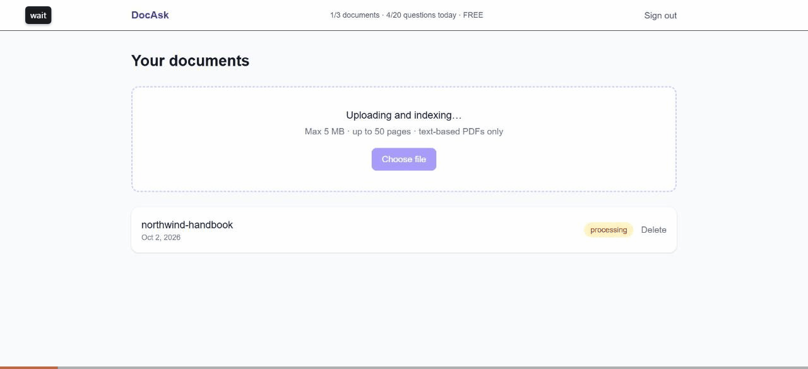

# DocAsk

Upload a PDF and ask questions about it. Every answer cites the passages and pages it came from.

- **Live demo:** https://docask.vercel.app


DocAsk is a small SaaS built as a portfolio project. It covers auth, per-user data isolation, file storage, vector search, an LLM integration and plan limits.

**Status:** phase 1 is complete (everything below). Phase 2 is coming next: a Stripe-powered Pro plan (Checkout, webhook, Customer Portal).

## Features

- Passwordless sign-in with a magic link (Supabase Auth)
- PDF upload to a private bucket, then text extraction and page-aware chunking
- Semantic search over your document (pgvector, 384-dimension embeddings)
- Answers from Claude with numbered citations that link back to page and passage
- Demo mode, so the app works without an AI key (see below)
- Free-plan limits enforced on the server: 3 documents, 5 MB per file, 50 pages, 20 questions per day (UTC)
- Question history that survives document deletion, so the daily quota can't be reset by deleting files

## Architecture

```
Browser --upload--> Supabase Storage (private bucket "pdfs", path {user_id}/{doc_id}.pdf)
   |
   |-> POST /api/documents/[id]/process  (Next.js route, server)
   |        unpdf -> page-aware chunks -> Edge Function "embed" (gte-small, 384-d) -> chunks table
   |
   '-> POST /api/ask  (Next.js route, server, streaming)
            embed question -> rpc match_chunks (RLS applies) -> Claude (or demo mode) -> questions table
```

- Next.js 16 (App Router), TypeScript, Tailwind CSS 4, deployed on Vercel
- Supabase: Auth, Postgres with pgvector, Storage, and one Edge Function
- Embeddings: Edge Function `embed` runs the built-in `gte-small` model (384 dimensions). No extra API key is needed.
- LLM: `claude-haiku-4-5` through the Anthropic SDK, called from the server only

## How security works

All access control is in the database, not just in application code.

- **Row Level Security on every table.** Users can only select rows where `user_id = auth.uid()` (`profiles` uses `id`).
- **No client writes to server-owned data.** `chunks` and `questions` have no client write policies; the server writes them with the secret key. `documents` has no update policy, so `status`, `page_count` and `error` can only be set by the server.
- **Constrained inserts.** A client can insert a `documents` row only with `status = 'processing'` and a `storage_path` of the form `<uid>/<id>.pdf`.
- **Plan can't be self-upgraded.** `profiles` has no update policy, so users can't change `plan`.
- **Search respects RLS.** `match_chunks` is `security invoker`, so the `chunks` policy applies inside the function. Execute is revoked from `anon`.
- **Private storage.** The `pdfs` bucket is private. Policies only allow reading, uploading and deleting objects under the caller's own `<uid>/` folder.
- **History outlives documents.** `questions.document_id` is nullable (`on delete set null`), so deleting a document keeps quota history.
- **Authenticated embeddings.** The `embed` function calls `/auth/v1/user` to confirm the caller is a real signed-in user, because the gateway also accepts the public publishable key.
- **Server-only secrets.** `SUPABASE_SECRET_KEY` and `ANTHROPIC_API_KEY` have no `NEXT_PUBLIC_` prefix and are never sent to the browser.
- **Limits live on the server.** Document, size, page and daily question limits come from `src/lib/plans.ts` and are checked in the API routes.

These rules are verified by an integration test (see Tests).

## Local setup

Requirements: Node 22.12 or newer, and a Supabase project.

```bash
npm install
cp .env.example .env.local        # then fill in the values
npx supabase link --project-ref <your-project-ref>
npx supabase db push              # applies supabase/migrations
npx supabase functions deploy embed
npm run dev -- -p 3005
```

Open http://localhost:3005. When using a hosted Supabase project, add `http://localhost:3005/auth/callback` to Authentication → URL Configuration → Redirect URLs.

Notes:

- The magic link must be opened in the same browser that requested it.
- `npm run test:rls` needs the Email provider's password sign-in enabled (it is on by default).
- A document stuck in "processing" for more than 2 minutes (for example after a timeout) shows a Retry button.

Environment variables (see `.env.example`):

| Variable | Notes |
|---|---|
| `NEXT_PUBLIC_SUPABASE_URL` | Supabase project URL (Project Settings, API) |
| `NEXT_PUBLIC_SUPABASE_PUBLISHABLE_KEY` | Publishable key; safe in the browser |
| `SUPABASE_SECRET_KEY` | Server only. Bypasses RLS. Never commit it. |
| `ANTHROPIC_API_KEY` | Optional. If empty, the app runs in demo mode. |

## Demo mode

If `ANTHROPIC_API_KEY` is empty, DocAsk still runs the whole pipeline (upload, chunking, embeddings, search) and answers with the most relevant passages and their page numbers instead of a written answer. The same fallback is used if a Claude request fails or times out (30 seconds). Each saved question records its mode (`ai` or `demo`).

## Tests

```bash
npm test          # unit tests (chunking, plan limits, answer helpers)
npm run test:rls  # integration test of RLS and storage policies
```

`npm run test:rls` runs against your linked Supabase project, not a local mock. It needs `SUPABASE_SECRET_KEY` in `.env.local`. It creates temporary users and removes them (and their data) when it finishes.

## Deploy

1. Import the repo in Vercel.
2. Add the environment variables above (`ANTHROPIC_API_KEY` is optional).
3. In Supabase, go to Authentication, URL Configuration. Set the Site URL to your Vercel domain and add `https://<domain>/auth/callback` to the redirect URLs.
4. Make sure migrations are pushed and the `embed` function is deployed (see Local setup).
